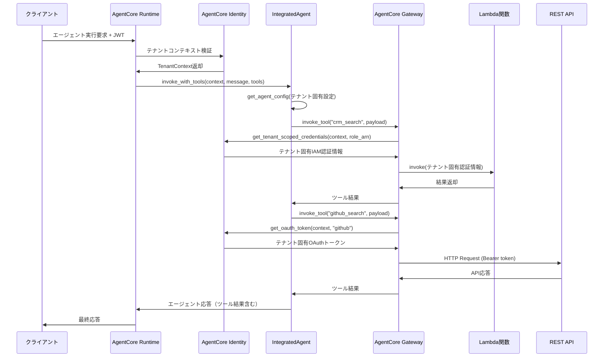
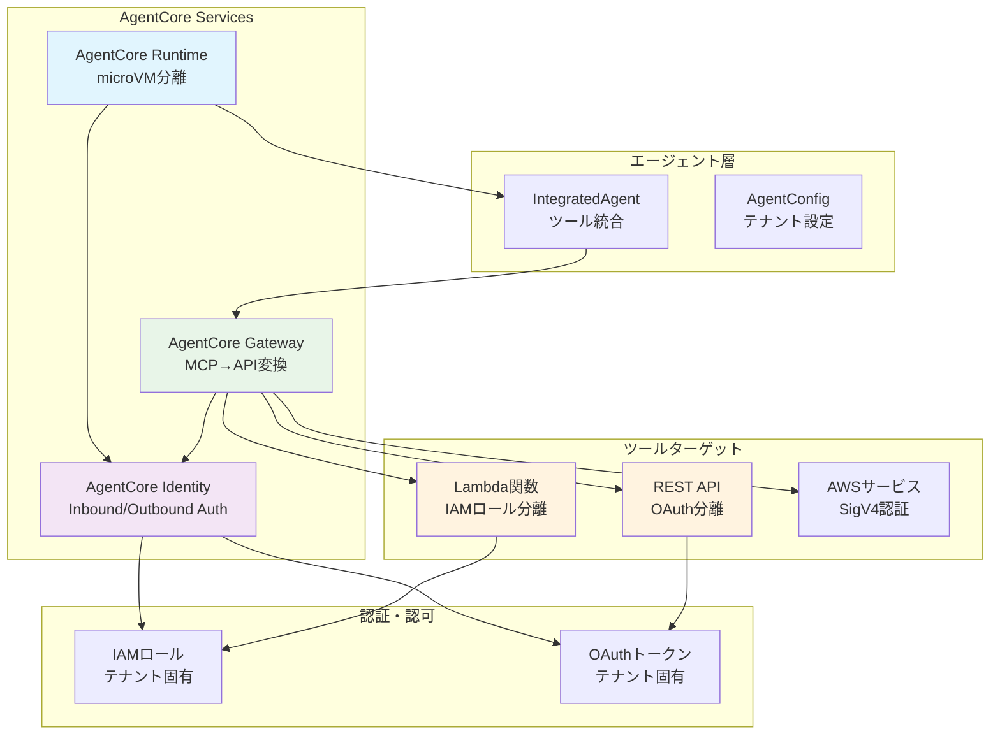
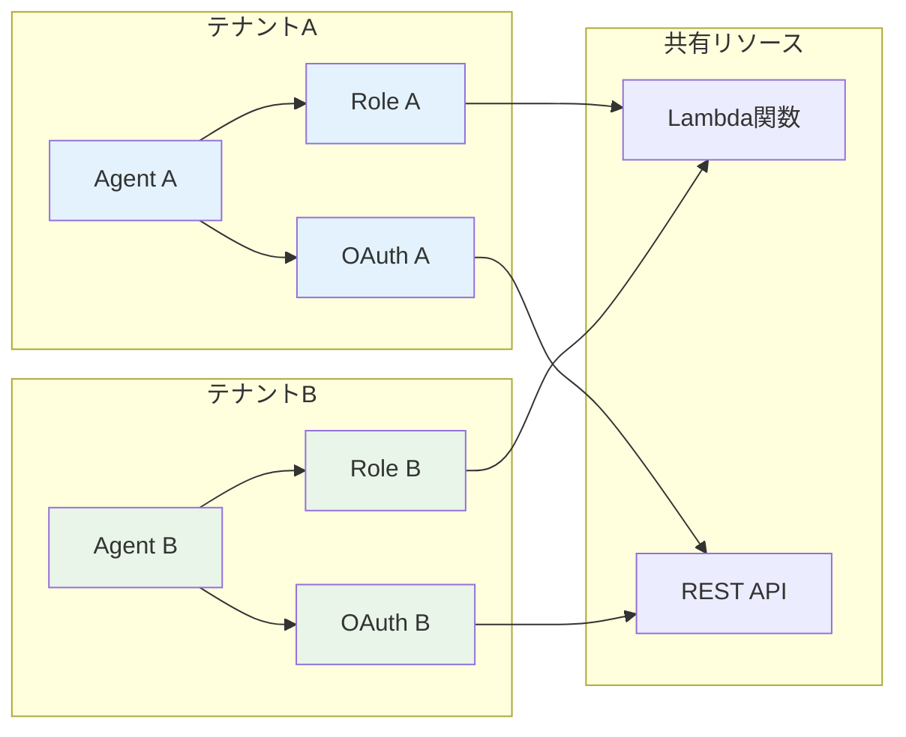

# AgentCore統合アーキテクチャ フロー図

```mermaid
sequenceDiagram
    participant Client as クライアント
    participant Runtime as AgentCore Runtime
    participant Identity as AgentCore Identity
    participant Agent as IntegratedAgent
    participant Gateway as AgentCore Gateway
    participant Lambda as Lambda関数
    participant API as REST API

    %% 認証・初期化
    Client->>Runtime: エージェント実行要求 + JWT
    Runtime->>Identity: テナントコンテキスト検証
    Identity->>Runtime: TenantContext返却

    %% エージェント実行
    Runtime->>Agent: invoke_with_tools(context, message, tools)
    Agent->>Agent: get_agent_config(テナント固有設定)

    %% ツール実行（Lambda）
    Agent->>Gateway: invoke_tool("crm_search", payload)
    Gateway->>Identity: get_tenant_scoped_credentials(context, role_arn)
    Identity->>Gateway: テナント固有IAM認証情報
    Gateway->>Lambda: invoke(テナント固有認証情報)
    Lambda->>Gateway: 結果返却
    Gateway->>Agent: ツール結果

    %% ツール実行（REST API）
    Agent->>Gateway: invoke_tool("github_search", payload)
    Gateway->>Identity: get_oauth_token(context, "github")
    Identity->>Gateway: テナント固有OAuthトークン
    Gateway->>API: HTTP Request (Bearer token)
    API->>Gateway: API応答
    Gateway->>Agent: ツール結果

    %% 最終応答
    Agent->>Runtime: エージェント応答（ツール結果含む）
    Runtime->>Client: 最終応答
```

## AgentCore統合アーキテクチャ

```mermaid
graph TB
    subgraph "AgentCore Services"
        Runtime[AgentCore Runtime<br/>microVM分離]
        Identity[AgentCore Identity<br/>Inbound/Outbound Auth]
        Gateway[AgentCore Gateway<br/>MCP→API変換]
    end

    subgraph "エージェント層"
        Agent[IntegratedAgent<br/>ツール統合]
        Config[AgentConfig<br/>テナント設定]
    end

    subgraph "ツールターゲット"
        Lambda[Lambda関数<br/>IAMロール分離]
        RestAPI[REST API<br/>OAuth分離]
        AWS[AWSサービス<br/>SigV4認証]
    end

    subgraph "認証・認可"
        IAM[IAMロール<br/>テナント固有]
        OAuth[OAuthトークン<br/>テナント固有]
    end

    Runtime --> Identity
    Runtime --> Agent
    Agent --> Gateway
    Gateway --> Identity
    Identity --> IAM
    Identity --> OAuth
    Gateway --> Lambda
    Gateway --> RestAPI
    Gateway --> AWS
    Lambda --> IAM
    RestAPI --> OAuth

    style Runtime fill:#e1f5fe
    style Identity fill:#f3e5f5
    style Gateway fill:#e8f5e8
    style Lambda fill:#fff3e0
    style RestAPI fill:#fff3e0
```

## セキュリティ分離パターン

```mermaid
graph LR
    subgraph "テナントA"
        TA[Agent A]
        RA[Role A]
        OA[OAuth A]
    end

    subgraph "テナントB"
        TB[Agent B] 
        RB[Role B]
        OB[OAuth B]
    end

    subgraph "共有リソース"
        L[Lambda関数]
        API[REST API]
    end

    TA --> RA
    TA --> OA
    TB --> RB
    TB --> OB
    RA --> L
    RB --> L
    OA --> API
    OB --> API

    style TA fill:#e3f2fd
    style TB fill:#e8f5e8
    style RA fill:#e3f2fd
    style RB fill:#e8f5e8
    style OA fill:#e3f2fd
    style OB fill:#e8f5e8
```
