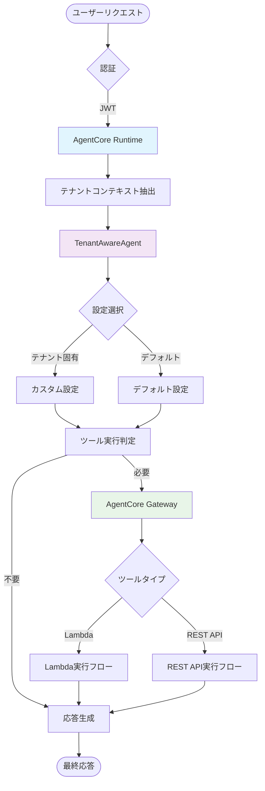
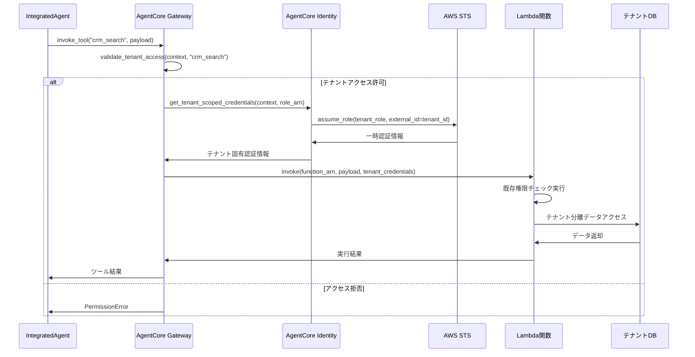
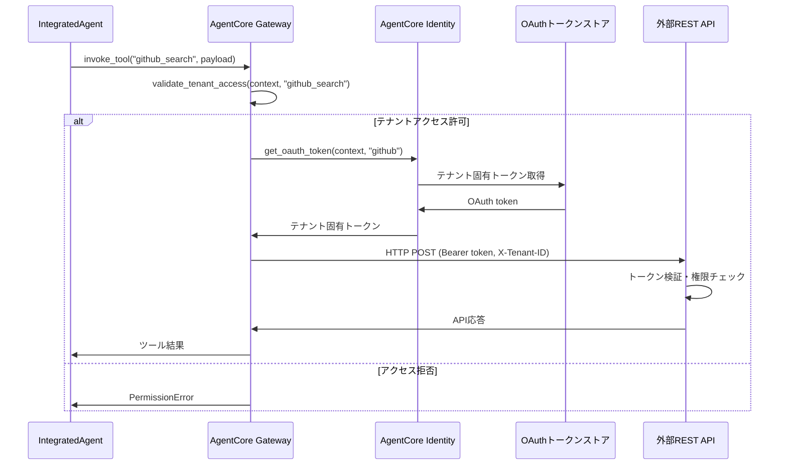
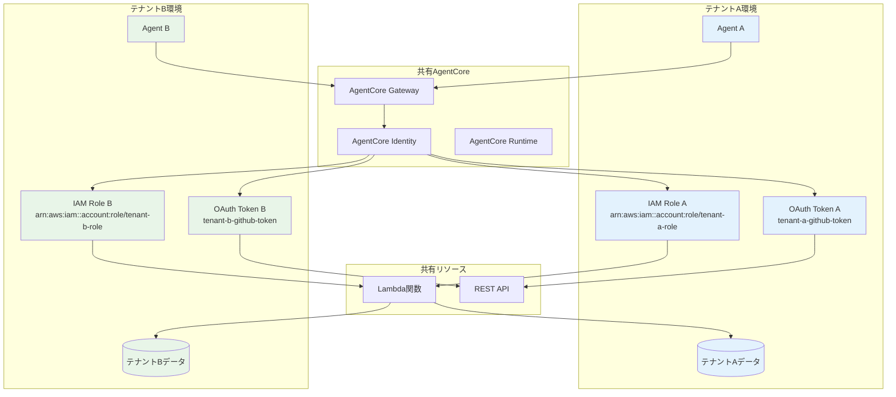
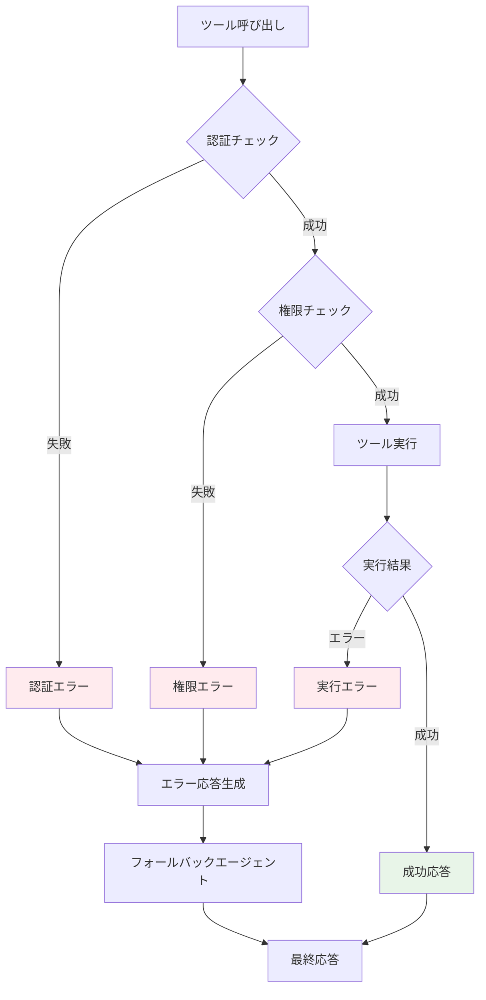
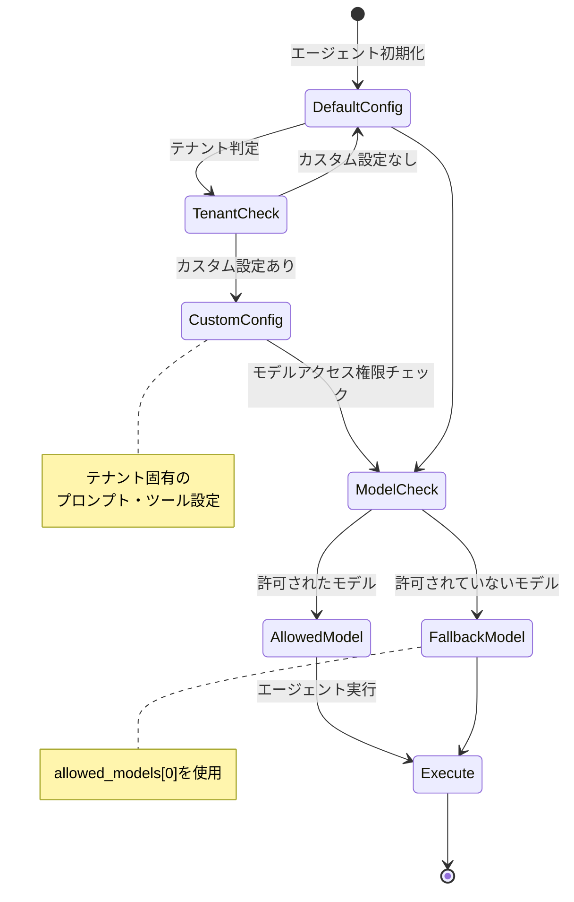

# AgentCore統合 詳細フロー図

## 1. 全体システムフロー

```mermaid
flowchart TD
    Start([ユーザーリクエスト]) --> Auth{認証}
    Auth -->|JWT| Runtime[AgentCore Runtime]
    Runtime --> Extract[テナントコンテキスト抽出]
    Extract --> Agent[TenantAwareAgent]
    Agent --> Config{設定選択}
    Config -->|テナント固有| CustomConfig[カスタム設定]
    Config -->|デフォルト| DefaultConfig[デフォルト設定]
    CustomConfig --> Tools[ツール実行判定]
    DefaultConfig --> Tools
    Tools -->|必要| Gateway[AgentCore Gateway]
    Tools -->|不要| Response[応答生成]
    Gateway --> ToolType{ツールタイプ}
    ToolType -->|Lambda| LambdaFlow[Lambda実行フロー]
    ToolType -->|REST API| APIFlow[REST API実行フロー]
    LambdaFlow --> Response
    APIFlow --> Response
    Response --> End([最終応答])

    style Runtime fill:#e1f5fe
    style Gateway fill:#e8f5e8
    style Agent fill:#f3e5f5
```

## 2. Lambda実行フロー（詳細）

```mermaid
sequenceDiagram
    participant Agent as IntegratedAgent
    participant Gateway as AgentCore Gateway
    participant Identity as AgentCore Identity
    participant STS as AWS STS
    participant Lambda as Lambda関数
    participant DB as テナントDB

    Agent->>Gateway: invoke_tool("crm_search", payload)
    Gateway->>Gateway: validate_tenant_access(context, "crm_search")
    
    alt テナントアクセス許可
        Gateway->>Identity: get_tenant_scoped_credentials(context, role_arn)
        Identity->>STS: assume_role(tenant_role, external_id=tenant_id)
        STS->>Identity: 一時認証情報
        Identity->>Gateway: テナント固有認証情報
        
        Gateway->>Lambda: invoke(function_arn, payload, tenant_credentials)
        Lambda->>Lambda: 既存権限チェック実行
        Lambda->>DB: テナント分離データアクセス
        DB->>Lambda: データ返却
        Lambda->>Gateway: 実行結果
        Gateway->>Agent: ツール結果
    else アクセス拒否
        Gateway->>Agent: PermissionError
    end
```

## 3. REST API実行フロー（詳細）

```mermaid
sequenceDiagram
    participant Agent as IntegratedAgent
    participant Gateway as AgentCore Gateway
    participant Identity as AgentCore Identity
    participant TokenStore as OAuthトークンストア
    participant API as 外部REST API

    Agent->>Gateway: invoke_tool("github_search", payload)
    Gateway->>Gateway: validate_tenant_access(context, "github_search")
    
    alt テナントアクセス許可
        Gateway->>Identity: get_oauth_token(context, "github")
        Identity->>TokenStore: テナント固有トークン取得
        TokenStore->>Identity: OAuth token
        Identity->>Gateway: テナント固有トークン
        
        Gateway->>API: HTTP POST (Bearer token, X-Tenant-ID)
        API->>API: トークン検証・権限チェック
        API->>Gateway: API応答
        Gateway->>Agent: ツール結果
    else アクセス拒否
        Gateway->>Agent: PermissionError
    end
```

## 4. テナント分離の実装パターン

```mermaid
graph TB
    subgraph "テナントA環境"
        A_Agent[Agent A]
        A_Role[IAM Role A<br/>arn:aws:iam::account:role/tenant-a-role]
        A_Token[OAuth Token A<br/>tenant-a-github-token]
        A_Data[(テナントAデータ)]
    end

    subgraph "テナントB環境"
        B_Agent[Agent B]
        B_Role[IAM Role B<br/>arn:aws:iam::account:role/tenant-b-role]
        B_Token[OAuth Token B<br/>tenant-b-github-token]
        B_Data[(テナントBデータ)]
    end

    subgraph "共有AgentCore"
        Gateway[AgentCore Gateway]
        Identity[AgentCore Identity]
        Runtime[AgentCore Runtime]
    end

    subgraph "共有リソース"
        Lambda[Lambda関数]
        RestAPI[REST API]
    end

    A_Agent --> Gateway
    B_Agent --> Gateway
    Gateway --> Identity
    Identity --> A_Role
    Identity --> B_Role
    Identity --> A_Token
    Identity --> B_Token
    A_Role --> Lambda
    B_Role --> Lambda
    A_Token --> RestAPI
    B_Token --> RestAPI
    Lambda --> A_Data
    Lambda --> B_Data

    style A_Agent fill:#e3f2fd
    style B_Agent fill:#e8f5e8
    style A_Role fill:#e3f2fd
    style B_Role fill:#e8f5e8
    style A_Token fill:#e3f2fd
    style B_Token fill:#e8f5e8
    style A_Data fill:#e3f2fd
    style B_Data fill:#e8f5e8
```

## 5. エラーハンドリングフロー

```mermaid
flowchart TD
    ToolCall[ツール呼び出し] --> AuthCheck{認証チェック}
    AuthCheck -->|失敗| AuthError[認証エラー]
    AuthCheck -->|成功| PermCheck{権限チェック}
    PermCheck -->|失敗| PermError[権限エラー]
    PermCheck -->|成功| Execute[ツール実行]
    Execute --> ExecCheck{実行結果}
    ExecCheck -->|エラー| ExecError[実行エラー]
    ExecCheck -->|成功| Success[成功応答]
    
    AuthError --> ErrorResponse[エラー応答生成]
    PermError --> ErrorResponse
    ExecError --> ErrorResponse
    ErrorResponse --> FallbackAgent[フォールバックエージェント]
    FallbackAgent --> FinalResponse[最終応答]
    Success --> FinalResponse

    style AuthError fill:#ffebee
    style PermError fill:#ffebee
    style ExecError fill:#ffebee
    style Success fill:#e8f5e8
```

## 6. 設定管理フロー

```mermaid
stateDiagram-v2
    [*] --> DefaultConfig: エージェント初期化
    DefaultConfig --> TenantCheck: テナント判定
    TenantCheck --> CustomConfig: カスタム設定あり
    TenantCheck --> DefaultConfig: カスタム設定なし
    CustomConfig --> ModelCheck: モデルアクセス権限チェック
    DefaultConfig --> ModelCheck
    ModelCheck --> AllowedModel: 許可されたモデル
    ModelCheck --> FallbackModel: 許可されていないモデル
    AllowedModel --> Execute: エージェント実行
    FallbackModel --> Execute
    Execute --> [*]

    note right of CustomConfig
        テナント固有の
        プロンプト・ツール設定
    end note
    
    note right of FallbackModel
        allowed_models[0]を使用
    end note
```
