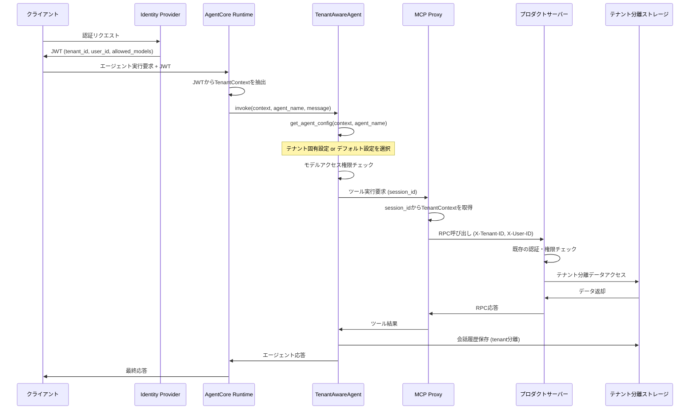
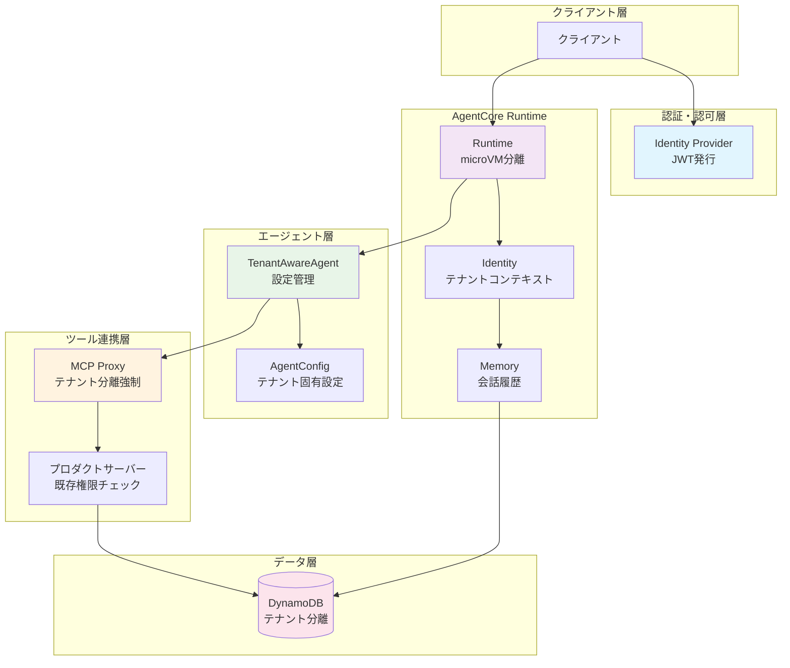
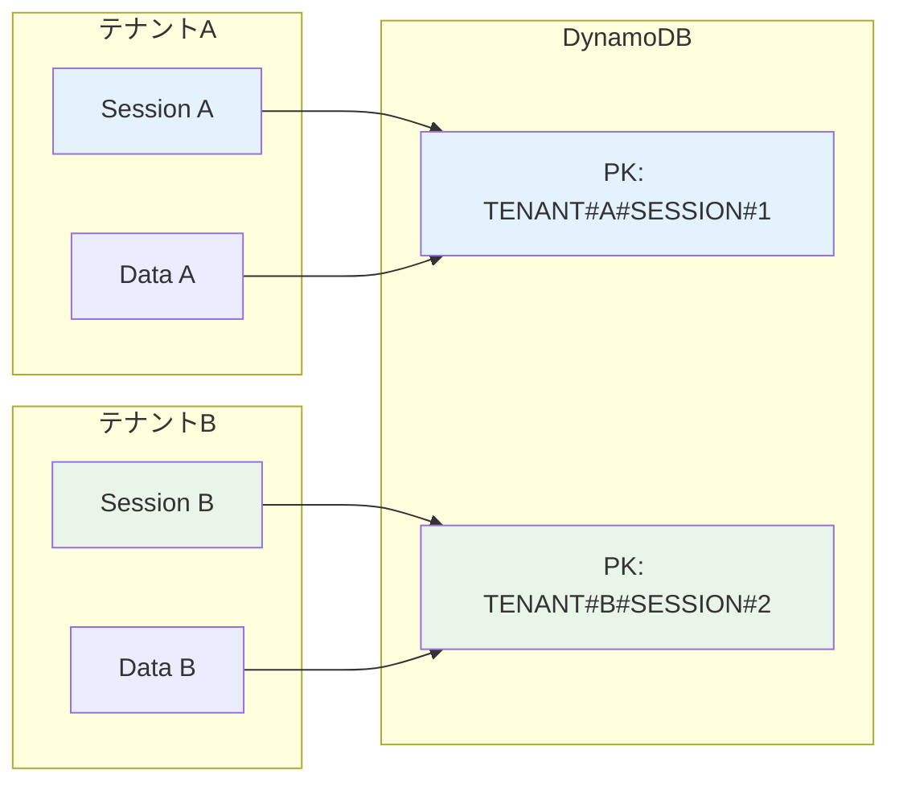

# マルチテナントAIエージェント フロー図

```mermaid
sequenceDiagram
    participant Client as クライアント
    participant IdP as Identity Provider
    participant Runtime as AgentCore Runtime
    participant Agent as TenantAwareAgent
    participant Proxy as MCP Proxy
    participant Product as プロダクトサーバー
    participant Storage as テナント分離ストレージ

    %% 認証フロー
    Client->>IdP: 認証リクエスト
    IdP->>Client: JWT (tenant_id, user_id, allowed_models)

    %% エージェント呼び出し
    Client->>Runtime: エージェント実行要求 + JWT
    Runtime->>Runtime: JWTからTenantContextを抽出
    Runtime->>Agent: invoke(context, agent_name, message)

    %% テナント固有設定の取得
    Agent->>Agent: get_agent_config(context, agent_name)
    Note over Agent: テナント固有設定 or デフォルト設定を選択
    Agent->>Agent: モデルアクセス権限チェック

    %% ツール呼び出し（必要時）
    Agent->>Proxy: ツール実行要求 (session_id)
    Proxy->>Proxy: session_idからTenantContextを取得
    Proxy->>Product: RPC呼び出し (X-Tenant-ID, X-User-ID)
    Product->>Product: 既存の認証・権限チェック
    Product->>Storage: テナント分離データアクセス
    Storage->>Product: データ返却
    Product->>Proxy: RPC応答
    Proxy->>Agent: ツール結果

    %% 応答生成
    Agent->>Storage: 会話履歴保存 (tenant分離)
    Agent->>Runtime: エージェント応答
    Runtime->>Client: 最終応答
```

## アーキテクチャ概要

```mermaid
graph TB
    subgraph "クライアント層"
        C[クライアント]
    end

    subgraph "認証・認可層"
        IdP[Identity Provider<br/>JWT発行]
    end

    subgraph "AgentCore Runtime"
        R[Runtime<br/>microVM分離]
        I[Identity<br/>テナントコンテキスト]
        M[Memory<br/>会話履歴]
    end

    subgraph "エージェント層"
        A[TenantAwareAgent<br/>設定管理]
        AC[AgentConfig<br/>テナント固有設定]
    end

    subgraph "ツール連携層"
        P[MCP Proxy<br/>テナント分離強制]
        PS[プロダクトサーバー<br/>既存権限チェック]
    end

    subgraph "データ層"
        DB[(DynamoDB<br/>テナント分離)]
    end

    C --> IdP
    C --> R
    R --> I
    R --> A
    A --> AC
    A --> P
    P --> PS
    PS --> DB
    I --> M
    M --> DB

    style IdP fill:#e1f5fe
    style R fill:#f3e5f5
    style A fill:#e8f5e8
    style P fill:#fff3e0
    style DB fill:#fce4ec
```

## データ分離パターン

```mermaid
graph LR
    subgraph "テナントA"
        TA[Session A]
        DA[Data A]
    end

    subgraph "テナントB" 
        TB[Session B]
        DB[Data B]
    end

    subgraph "DynamoDB"
        PK1[PK: TENANT#A#SESSION#1]
        PK2[PK: TENANT#B#SESSION#2]
    end

    TA --> PK1
    TB --> PK2
    DA --> PK1
    DB --> PK2

    style TA fill:#e3f2fd
    style TB fill:#e8f5e8
    style PK1 fill:#e3f2fd
    style PK2 fill:#e8f5e8
```
